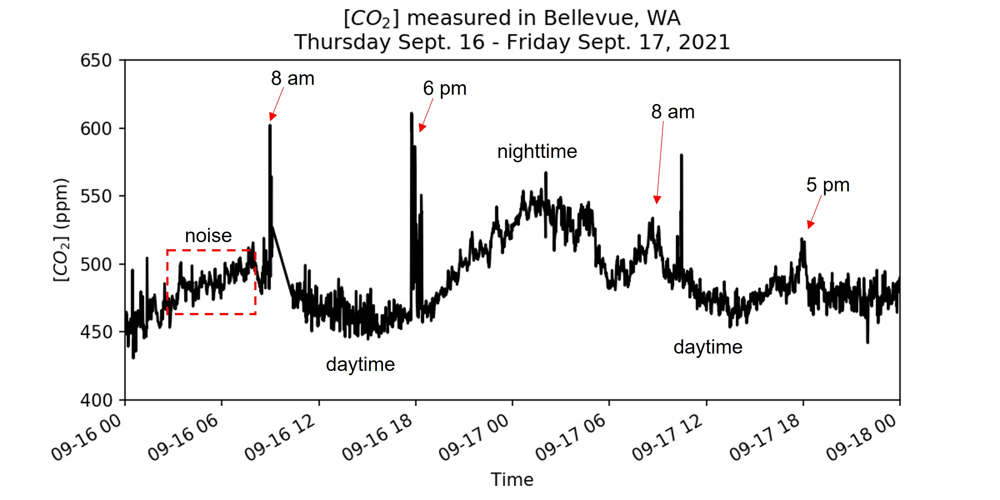

# Ribbit Network Frequently Asked Questions
Frequently Asked Questions About the Ribbit Network

Ribbit Network is the world's largest crowdsourced network of open-source, low-cost, Greenhouse Gas Detection Sensors.

This project will create the world's largest Greenhouse Gas Emissions dataset that will empower anyone to join in the work on climate and provide informed data for climate action.

See more details about:
* [The Web Database](https://github.com/Ribbit-Network/ribbit-network-dashboard/blob/main/README.md)
* [The Frog Sensors](https://github.com/Ribbit-Network/ribbit-network-frog-sensor)

## F.A.Q.

### Do I need to build a Frog Sensor myself or can I buy one pre-assembled?
This project is and will always be Open-Source, meaning you are encouraged to build a sensor yourself! However, you can also purchase an assembled sensor at [ribbitnetwork.org](https://ribbitnetwork.org/).

### How does the sensor connect to the Internet?
The sensor uses a wi-fi radio to connect to the internet in order to send sensor data to the Ribbit Network Database and recieve Software Updates from the Ribbit team.

### Can the public data be used to locate my sensor?
[The sensor rounds it's GPS location](https://github.com/Ribbit-Network/ribbit-network-frog-sensor/issues/41) it publishes to the public database. This means that it is not possible to specifically locate the sensor. Additionally, the sensor does not contain or publish any personal data, limiting privacy concerns.

### Is it possible to connect the sensor using an ethernet cord instead of wi-fi?
Yes, this is possible, as there is an ethernet port on the Raspberry Pi carrier board inside. However, we suggest the wifi connection which allows the most flexibility in sensor placement.

### How long is the power cord?
The power cable is 1.5 meters (5 feet) long. An extension cord can easily be added if you need a longer cord.

### How does this more distributed sensor device approach compare to current techniques of monitoring atmospheric CO2 (e.g. from orbit via satellite)?

Atmospheric monitoring from space is an exciting development that has a lot of potential. I'm from an aerospace background, so that was of course where I looked first. However, it's not a magic bullet solution, so I think that the best version of the future is to develop both technologies that can work together:
* Climate tech satellites are the MOST expensive possible solution. For example, [NASA's OCO2, cost $467.7 million.](https://www.jpl.nasa.gov/news/press_kits/oco2-launch-press-kit.pdf) Currently the ground based frog sensors cost ~250 to build and assemble. At those prices, we could build 1868000 ground-based sensors for the cost of one satellite. And as you'll see in the next bullet point, we need more than one.
* The big problem with satellites is that they have a limited number of measurements that they can take in a day. [If you check out the "Approximate usable
daily soundings"](https://en.wikipedia.org/wiki/Space-based_measurements_of_carbon_dioxide#List_of_instruments) you can see how many measurements a day a sat can take. Using the OCO2 example again, it can take about 100,000 1.3 × 2.2 km squares a day. At those rates, it's very difficult to measure a meaningful portion of the earth with any frequency. I believe that having real time constant monitoring of an area is important to help catch peak emission events like a power plant natural gas plant turning on briefly during peak load. It's hard to imagine a cost effective sat solution that could provide that.
* Finally, the satellite data is awesome, but many of the sensing technologies are still unproven. They need a "truth" dataset to validate that the satellites are producing accurate data. A ground based network like Ribbit is an excellent complement to a sat network because it can provide that truth! 

### How do the frog sensors measure CO2 concentration?

The concentration of CO2 in the air is measured using a [Nondispersive infrared (NDIR) sensor](https://en.wikipedia.org/wiki/Nondispersive_infrared_sensor). 
These sensors are a type of [spectroscopic](https://en.wikipedia.org/wiki/Spectroscopy) instrument, that is they measure light and how that light interacts with a material at specific wavelengths. 
In the case of measuring CO2, light at a wavelength in the mid-infrared part of the electromagnetic spectrum is emitted, passes through a small chamber that is open to the outside air, and a detector then measures the intensity of that light.
Light at the mid-infrared wavelength of 4.26 μm (4.26 x 10^-6 meters) in particular is absorbed by CO2 molecules.
That means that a portion of the emitted light will effectively be blocked by CO2 in the air in proportion to the amount of CO2. 
The difference between the intensity of the emitted light and the intensity of the detected light can be used to determine the CO2 concentration.

 

This plot from the National Institute of Standards and Technology shows the transmittance of light (y-axis) through CO2 across a range of wavelengths (x-axis). Note the narrow dip in transmittance down to nearly zero left of the 5 μm mark. This is the 4.26 μm [absorption band](https://en.wikipedia.org/wiki/Absorption_band) of CO2 that the NDIR sensors are looking for.

These measurements need to take into account air temperature and pressure, which is why the frog sensors also measure these properties. 
The [ideal gas law](https://en.wikipedia.org/wiki/Ideal_gas_law), in the form PV = nRT describes the relationship between the pressure (P),  volume (V), temperature (T), and amount of a gas substance (n) with the ideal gas constant (R).
We are interested in measuring the concentration of CO2 in ppm (parts per million) which is a ratio of the number of CO2 molecules to the total number of molecules in a sample volume of air.

The NDIR sensor however, is measuring through spectroscopy the amount of CO2 (n) in a particular volume (V).
Rearanging the ideal gas law equation we can get n/V = R(P/T), showing that concentration per volume (n/V) will be proportional to pressure (P) and inversely proportional to temperature (T).
This means that as air pressure increases more air molecules will be within the sample volume and we can expect the amount of CO2 detected in that volume to be greater even though the ratio of CO2 to total air molecules remains the same.
Conversely as temperature increases and air molecules move around faster fewer air molecules will be within the sample volume and we can expect the amount of CO2 detected in that volume to be smaller.
Read more details about how temperature and pressure affect NDIR CO2 measurements [here](https://www.bapihvac.com/wp-content/uploads/2011/04/Altitude_Temperature_and_CO2.pdf).

### What "should" the CO2 data look like?

If you have completed [assembling and setting up your frog sensor](https://github.com/Ribbit-Network/ribbit-network-frog-sensor/blob/main/assembly-instructions/0-start-here.md) or if you are looking at data on the [dashboard](https://ribbit-network.herokuapp.com/) you might be wondering what the CO2 data plotted over time "should" look like, or why it looks the way it does.

#### Cycles and patterns:
Plants take up CO2 for use in photosynthesis during the day. Your CO2 sensor may pick up on this daily (also called diurnal) cycle! In areas with lots of vegetation, you may see CO2 concentrations rise during the nighttime when plants are not performing photosynthesis, but as the sun rises and plants "wake up" the CO2 levels may decrease. You can see evidence of this cycle in the plot above.

This plant-driven cycle also changes seasonally, with deciduous vegetation active in the summer lowering CO2 concentrations, and inactive in the winter allowing CO2 concentrations to rise. In fact, because most of Earth's forests are located in the Northern Hemisphere, this seasonal cycle can be seen in global estimates of atmospheric CO2. During the Northern Hemisphere summer global average CO2 is less than that in the Northern Hemisphere winter. Read more about the differences in CO2 patterns by latitude in [this article from the Scripps Institution of Oceanography](https://keelingcurve.ucsd.edu/2013/05/07/why-are-seasonal-co2-fluctuations-strongest-in-northern-latitudes/).

You may also see diurnal patterns caused by human activity. If your sensor is in an urban or suburban residential area you may see increases in CO2 concentration during peak hours of car traffic, such as from morning and afternoon commutes as people drive to and from workplaces. In the plot above, there are some rises in CO2 concentration (not the narrowest spikes though) around 8 am and 5 pm on the 17th that may be caused by car traffic.

For more examples, see [this research paper (Imasu & Tanabe, 2018)](http://dx.doi.org/10.3390/atmos9100367) which used NDIR CO2 sensors at different locations around Tokyo, Japan to look at CO2 concentration patterns.

#### Noisy data or spikes

You may see "noisy" data where the CO2 measurements bounces up and down minute to minute creating jagged lines on the plots (such as in the plot above). This is to be expected somewhat, and can likely be attributed to the accuracy of the NDIR sensors. These relatively low-cost sensors have a manufacturer stated accuracy of +/- 30 ppm. This means that even if the local CO2 concentration is not changing, the measurements may bounce around by this amount.

Do you see "spikes" in the CO2 concentration where it rises steeply much more than typical noise, then drops back down over the course of several minutes? This is likely not noise, but a true measurement of air with elevated CO2! Think about the placement of your sensor, is it near a road or parking lot where passing or idling cars can create a "cloud" of exhaust that blows by the sensor? These spikes are signatures of nearby CO2 sources before the gas has dispersed. The plot above has several big jumps in CO2 concentration in the morning and in the evening, likely due to the sensor being installed near a parking lot, it could be picking up on local emissions from cars coming and going from the parking lot.

### Is the current rise in atmospheric CO2 that is driving climate change caused by human activity (primarily burning fossil fuels)?

Yes. ([1](https://climate.nasa.gov/causes/),[2](https://www.climate.gov/news-features/climate-qa/are-humans-causing-or-contributing-global-warming),[3](https://ec.europa.eu/clima/change/causes_en),[4](https://keelingcurve.ucsd.edu/2018/09/19/is-the-current-rise-in-co2-definitely-caused-by-human-activities/),[5](https://www.climate.gov/news-features/climate-qa/which-emits-more-carbon-dioxide-volcanoes-or-human-activities),[6](https://www.edf.org/climate/9-ways-we-know-humans-triggered-climate-change),[7](https://skepticalscience.com/co2-increase-is-natural-not-human-caused.htm),[8](https://www.science.org.au/learning/general-audience/science-climate-change/3-are-human-activities-causing-climate-change),[9](https://www.metoffice.gov.uk/weather/climate-change/causes-of-climate-change),[10](https://royalsociety.org/topics-policy/projects/climate-change-evidence-causes/question-3/),[11](https://www.ucsusa.org/resources/are-humans-major-cause-global-warming))

